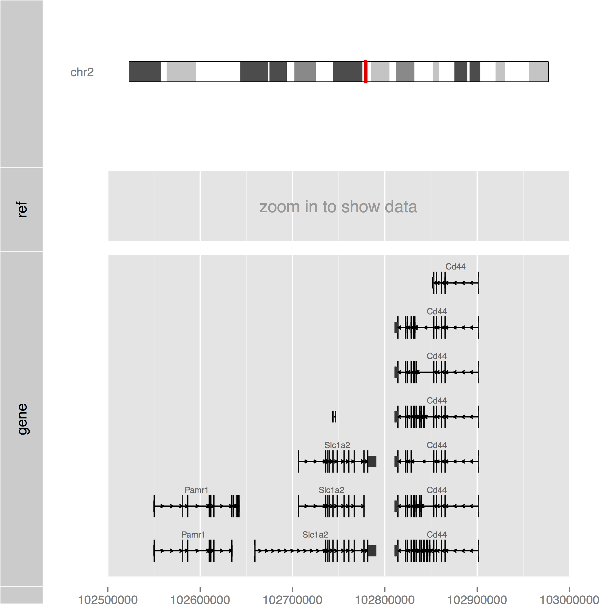

Orenogb
====

Visualization command for genomic data

## Description

## Demo

    $ R -q -f orenogb.R --args chr2 102500000 103000000 output.pdf

## Requirement
- R
- Bioconductor Software Packages
-- ggbio
-- GenomicRanges
- Bioconductor Annotation Packages
-- Mus.musculus
-- BSgenome.Mmusculus.UCSC.mm10

## Usage

    $ R -q -f orenogb.R --args [chr] [start bp] [end bp] [output file]

## Install

    R> source("http://bioconductor.org/biocLite.R")
    R> biocLite(c("ggbio", "GenomicRanges")
    R> biocLite(c("Mus.musculus", "BSgenome.Mmusculus.UCSC.mm10"))

## Contribution

## Licence

[MIT](https://github.com/dritoshi/tool/blob/master/LICENCE)

## Author

[dritoshi](https://github.com/dritoshi)
