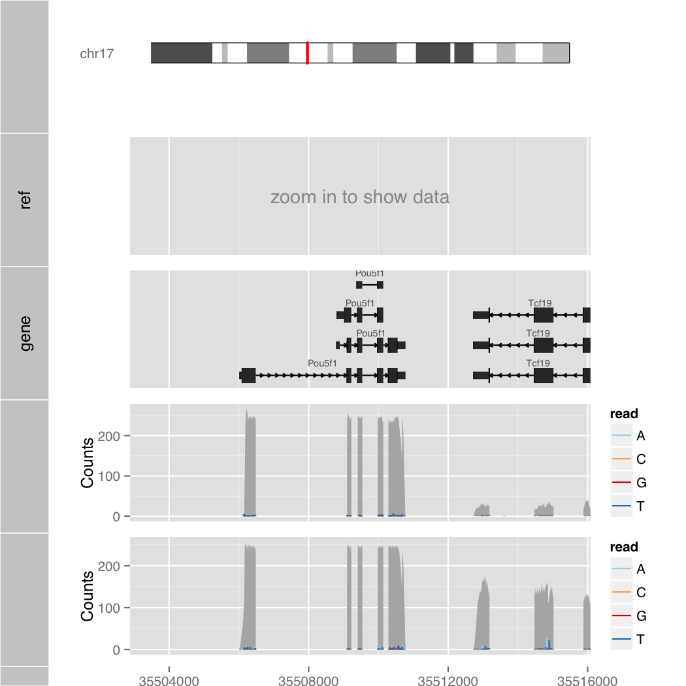

Orenogb
====

Visualization command for genomic data

## Description

## Demo

    $ R --slave --vanilla -f orenogb.R --args chr2 102500000 103000000 1 demo.pdf

### Exponential notation

    $ R --slave --vanilla-f orenogb.R --args chr2 1e8+2748000 1e8+2749000 1 demo2.pdf

### Semantic Zoom

    $ R --slave --vanilla -f orenogb.R --args chr2 1e8+2748000 1e8+2749000 1/100 demo3.pdf

## Requirement
- R
- Bioconductor Software Packages
    - ggbio
    - GenomicRanges
- Bioconductor Annotation Packages
    - Mus.musculus
    - BSgenome.Mmusculus.UCSC.mm10

## Usage

    $ R --slave --vanilla -f orenogb.R --args [chr] [start bp] [end bp] [zoom] [output file]

## Install

    $ git clone git@github.com:dritoshi/orenogb.git
    $ cd orenogb
    $ sudo R
    R> source("http://bioconductor.org/biocLite.R")
    R> biocLite(c("ggbio", "GenomicRanges")
    R> biocLite(c("Mus.musculus", "BSgenome.Mmusculus.UCSC.mm10"))

## ToDo
- import bam and bw data
- choose species
- wapper by shell script
- unit test

## Contribution

## Licence

[MIT](https://github.com/dritoshi/tool/blob/master/LICENCE)

## Author

[dritoshi](https://github.com/dritoshi)
