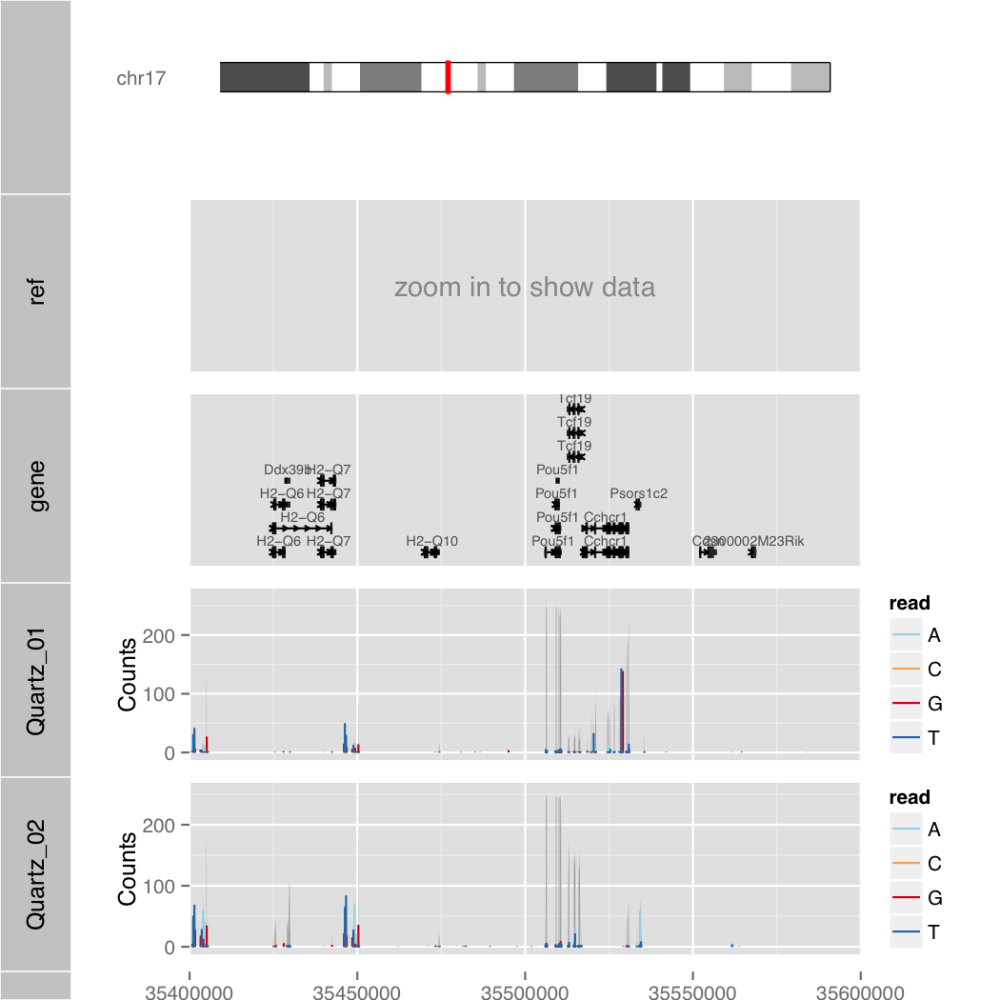
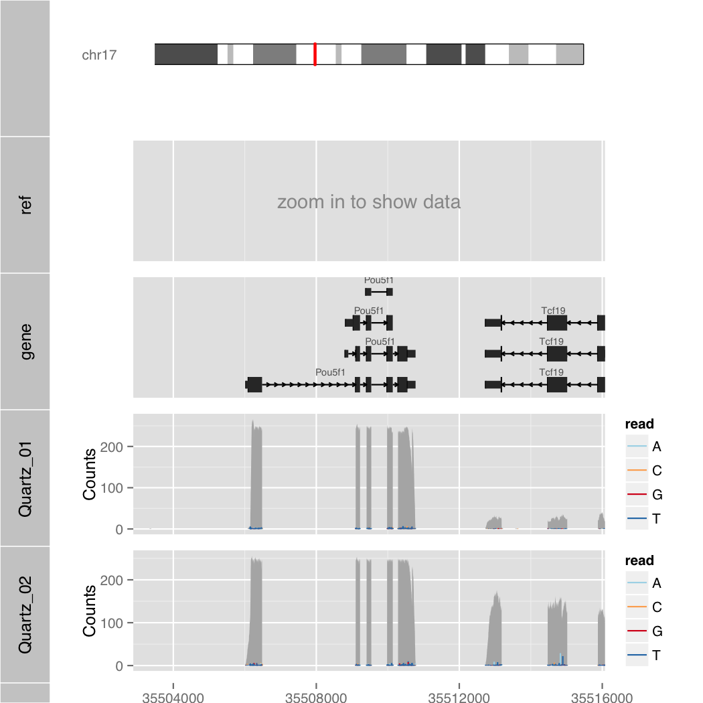

Orenogb
====

Visualization command for genomic data

## Description
- just type simple command on your terminal
- beautiful visualization by ggbio and ggplot2
- semantic zoom
- eaily loacing of transcriptome annotation

## Demo

    $ R --slave --vanilla -f orenogb.R --args chr17 35400000 35600000 1 Quartz_01.th.rmrRNA.bam,Quartz_02.th.rmrRNA.bam demo/demo.pdf

### Exponential notation

    $ R --slave --vanilla -f orenogb.R --args chr17 3.55e7+2880 3.55e7+16079 1 Quartz_01.th.rmrRNA.bam,Quartz_02.th.rmrRNA.bam demo/demo2.pdf

### Semantic Zoom

    $ R --slave --vanilla -f orenogb.R --args chr17 35502880 35516079 1/200 Quartz_01.th.rmrRNA.bam,Quartz_02.th.rmrRNA.bam demo/demo3.pdf

## Requirement
- R
- Bioconductor Software Packages
    - ggbio
    - GenomicRanges
    - GenomicAlignments
- Bioconductor Annotation Packages
    - Mus.musculus
    - BSgenome.Mmusculus.UCSC.mm10

## Usage

    $ R --slave --vanilla -f orenogb.R --args [chr] [start bp] [end bp] [zoom] [bam1,bam2,...] [output file]

## Install

    $ git clone git@github.com:dritoshi/orenogb.git
    $ cd orenogb
    $ sudo R
    R> source("http://bioconductor.org/biocLite.R")
    R> biocLite(c("ggbio", "GenomicRanges", "GenomicAlignments")
    R> biocLite(c("Mus.musculus", "BSgenome.Mmusculus.UCSC.mm10"))

## ToDo
- choose species
- wapper by shell script
- unit test
- retrive by genename
- deamonaize R script

## Contribution

## Licence

[MIT](https://github.com/dritoshi/orenogb/blob/master/LICENCE)

## Author

[dritoshi](https://github.com/dritoshi)
